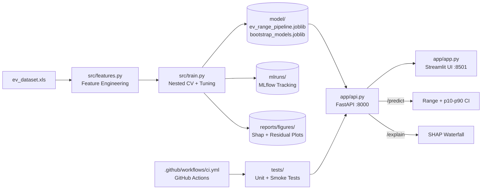

# ⚡ TechTrack EV Range Prediction

> Predicting electric vehicle driving range from static specifications using machine learning regression.  
> **v2.0 — Industry-Grade:** Nested CV · SHAP · MLflow · FastAPI · Bootstrap CI · Docker · GitHub Actions CI

---

## 🏗️ System Architecture



---

## 📌 Project Overview

**Task:** Regression — predict `range_km` from available EV specifications.

The prediction is **specification-based** — uses only manufacturer-published attributes (battery capacity, dimensions, motor torque, charging config). It does **not** incorporate real-time telemetry such as traffic, weather, HVAC load, or battery State of Health.

---

## 📊 Dataset

| Property | Value |
|---|---|
| Source file | `notebook/ev_dataset.xls` |
| Total rows | **478** EV models |
| Total columns | 22 |
| Unique brands | **59** |
| Granularity | One row per EV model |
| Target variable | `range_km` |
| Split | 70% train / 15% val / 15% test (seed=42) |

---

## 🤖 Validation Methodology (v2.0)

### Nested Cross-Validation (Honest Generalization Estimate)

| Loop | Role |
|---|---|
| **Outer: 5-fold CV** | Estimates true generalization error on data unseen during tuning |
| **Inner: RandomizedSearchCV (30 iter, 5-fold)** | Selects best hyperparameters |

> ⚠️ The outer-loop score is the **honest** estimate. The inner CV score is optimistic by design and is NOT reported as the model performance.

### Held-Out Test Set
15% of data is locked away before any training and touched only once for final reporting.

---

## 📏 Final Model Performance

### Outer-Loop (Nested CV) — Honest Generalization

| Metric | Mean ± Std |
|---|---|
| MAE | See training output |
| RMSE | See training output |
| R² | See training output |

### Held-Out Test Set (15% — never touched during tuning)

| Metric | Value |
|---|---|
| **MAE** | See training output |
| **RMSE** | See training output |
| **R²** | See training output |

> Run `make train` to regenerate all metrics.

---

## 🔬 Feature Engineering

Five domain-inspired engineered features:

| Feature | Formula |
|---|---|
| `footprint_m2` | `(length_mm × width_mm) / 1,000,000` |
| `volume_proxy_m3` | `(length_mm × width_mm × height_mm) / 1,000,000,000` |
| `battery_per_footprint` | `battery_capacity_kWh / footprint_m2` |
| `torque_per_battery` | `torque_nm / battery_capacity_kWh` |
| `battery_per_volume` | `battery_capacity_kWh / volume_proxy_m3` |

> `efficiency_wh_per_km` excluded — target leakage: `range_km ≈ battery_capacity_kWh × 1000 / efficiency_wh_per_km`

---

## 🔍 SHAP Interpretability

SHAP analysis is run automatically during training and saved to `reports/figures/`:

| Plot | File |
|---|---|
| Global beeswarm | `shap_summary_beeswarm.png` |
| Global bar (mean \|SHAP\|) | `shap_global_bar.png` |
| Dependence plots (top 5) | `shap_dependence_<feature>.png` |
| Waterfall — short range | `shap_waterfall_short.png` |
| Waterfall — medium range | `shap_waterfall_medium.png` |
| Waterfall — long range | `shap_waterfall_long.png` |

---

## 📁 Project Structure

```
EV_range_prediction/
├── .github/
│   └── workflows/
│       └── ci.yml              # GitHub Actions CI (tests + lint on push/PR)
├── app/
│   ├── api.py                  # FastAPI service (/predict, /explain, /health)
│   ├── app.py                  # Streamlit UI (calls FastAPI)
│   └── schemas.py              # Pydantic request/response models
├── model/
│   ├── ev_range_pipeline.joblib    # Final trained pipeline
│   └── bootstrap_models.joblib    # 500 bootstrap models for CI
├── notebook/
│   ├── EV_Range_Prediction.ipynb
│   └── ev_dataset.xls
├── reports/
│   └── figures/                # Auto-generated plots (gitignored)
├── src/
│   ├── features.py             # Pure feature engineering functions (tested)
│   ├── train.py                # Full training script (nested CV + SHAP + MLflow)
│   └── bootstrap.py            # Bootstrap CI module
├── tests/
│   ├── test_features.py        # Unit tests — all features.py functions
│   └── test_smoke.py           # Smoke tests — pipeline loading + sanity checks
├── report/
│   └── technical_report.pdf
├── Dockerfile
├── docker-compose.yml
├── Makefile
├── MODEL_CARD.md
├── README.md
└── requirements.txt            # Exact pinned versions
```

---

## ⚙️ Quick Start

### 1. Setup environment

```bash
git clone https://github.com/Devcoderakash/EV_range_prediction_model.git
cd EV_range_prediction_model
make setup       # Creates .venv and installs all pinned dependencies
```

### 2. Train the model (end-to-end)

```bash
make train
# Runs: data loading → feature engineering → nested CV → tuning →
#        residual analysis → SHAP → MLflow logging → bootstrap CI training
# Outputs: model/ev_range_pipeline.joblib, model/bootstrap_models.joblib,
#           reports/figures/*.png, mlruns/
```

### 3. Start the API

```bash
make api         # FastAPI on http://localhost:8000
# Docs: http://localhost:8000/docs
```

### 4. Start the Streamlit UI

```bash
make ui          # Streamlit on http://localhost:8501
# (requires API to be running on :8000)
```

### 5. Run tests

```bash
make test        # pytest unit + smoke tests
```

### 6. Explore MLflow runs

```bash
make mlflow      # MLflow UI on http://localhost:5000
```

### 7. Docker (run everything)

```bash
make docker      # docker compose up --build (API :8000, UI :8501)
```

---

## 🌐 API Reference

### `POST /predict`

Returns predicted range + p10–p90 bootstrap confidence interval.

**Request body** (21 EV spec fields):
```json
{
  "top_speed_kmh": 180,
  "battery_capacity_kWh": 77.4,
  "torque_nm": 350.0,
  "acceleration_0_100_s": 7.4,
  "fast_charging_power_kw_dc": 100.0,
  "seats": 5,
  "length_mm": 4180, "width_mm": 1800, "height_mm": 1445,
  "fast_charge_port": "CCS",
  "drivetrain": "RWD",
  "segment": "D - Large",
  "car_body_type": "Hatchback",
  ...
}
```

**Response:**
```json
{
  "prediction": 387.2,
  "p_lower": 361.0,
  "p_upper": 415.4,
  "interval_pct": "p10–p90",
  "units": "km"
}
```

### `POST /explain`
Returns SHAP values for the given input (used by Streamlit for waterfall plot).

### `GET /health`
Returns API and model load status.

---

## 🔄 Confidence Intervals (Bootstrap p10–p90)

500 XGBoost models are trained on bootstrap resamples of the training set. For each new prediction, all 500 models predict, and p10/p90 are taken as the interval bounds.

> These intervals capture **model uncertainty** (variance due to finite training data), not aleatoric uncertainty (real-world driving variation). True real-world uncertainty is substantially wider.

---

## ⚠️ Limitations

See [`MODEL_CARD.md`](MODEL_CARD.md) for the full detailed breakdown.

**Key limitations:**
- Static specs only — driving style, temperature, terrain, HVAC, and battery degradation not modeled
- Manufacturer-rated range figures (WLTP) overestimate real-world range by 10–20%
- Sparse brands (< 5 examples) have unreliable predictions
- Extrapolation risk for EVs outside training distribution

---

## 🧪 Testing & CI

| Test file | Coverage |
|---|---|
| `tests/test_features.py` | 34 unit tests — every function in `src/features.py` |
| `tests/test_smoke.py` | 9 smoke tests — pipeline loading, sanity, monotonicity |

GitHub Actions CI (`.github/workflows/ci.yml`) runs all tests + flake8 lint on every push and PR.

---

## 🚀 Future Improvements

- Integrate real-world owner-reported range data
- Add temperature-adjusted predictions using climate data
- Formal quantile regression for more calibrated intervals
- Periodic retraining as new EV models enter the market
- Conformal prediction for coverage-guaranteed intervals

---

## 👨‍💻 Project

**TechTrack EV Range Prediction v2.0**  
Built as part of the TechTrack machine learning challenge.

> Model: XGBoost Regressor · Framework: scikit-learn Pipeline · API: FastAPI · UI: Streamlit · Tracking: MLflow · Language: Python 3
